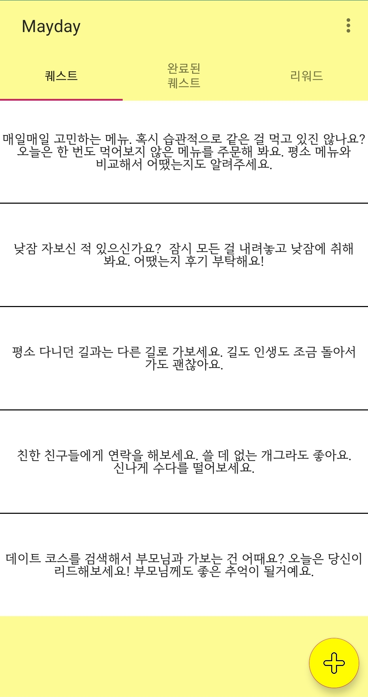
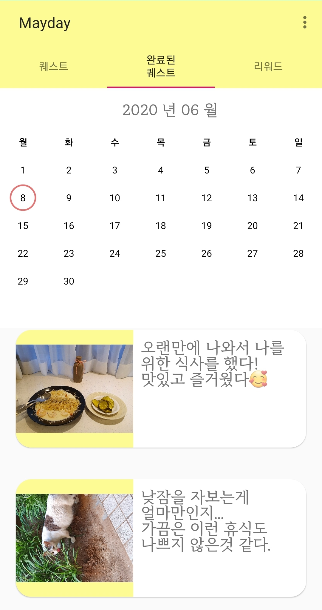
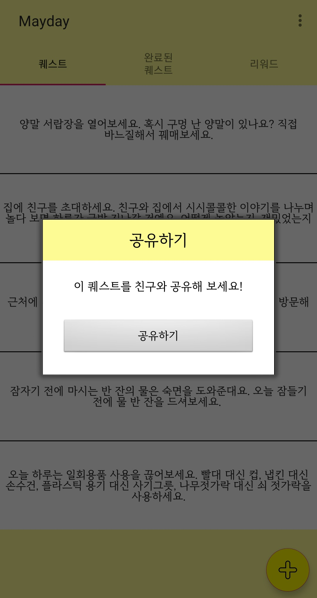

# 1. Mayday
성신여자대학교 스마트모바일프로그래밍 수업에서 만든 팀 프로젝트입니다.   
👍 Google Play Store : https://play.google.com/store/apps/details?id=com.mayday.Mayday  

## 1.1 기획 의도
우울감이나 무력감, 번아웃 증후군에 시달리는 현대인들을 위해 간단하지만 보람을 느낄 수 있는 일일 퀘스트를 무작위로 제공합니다. 제공한 퀘스트 달성 시 격려 문구 출력과, 모을 수 있는 리워드를 제공해 수집욕구를 자극합니다.   
또한 힐링을 통해 앱을 지속할 수 있는 원동력을 부여합니다.   

## 1.2 상세 컨텐츠
- 퀘스트 개수는 유저가 지정 가능 (최소 1개, 최대 5개)
- 퀘스트 출력 후 일정 시간 지난 후 (예-6시간) 미달성 상태일 시 푸쉬 알람으로 달성 독려
- 게임성을 부가해 앱 사용 지속력 부여. (예- 달성한 퀘스트 누적 개수 n개당 유저 레벨 업/리워드 종류는 뱃지, 칭찬스티커, 과일, 보석, 꽃 등등 다양한 리워드로 수집욕구 자극.)
- 유저가 직접 ‘나만의 퀘스트’를 작성할 수도 있음. 
- 친구와 퀘스트 내용, 달성한 퀘스트, 레벨업 결과를 sns로 공유 가능
- 퀘스트는 랜덤 출력이 기본이나 카테고리를 지정하여 출력하는 것도 가능   
	→ 출력 퀘스트 예시   
	<아웃도어 액티비티> 카테고리의 경우 : “오늘은 날씨가 참 좋네요. 햇빛을 받으며 20분 이상 걸어볼까요?”   
	<인도어 액티비티> 카테고리의 경우 : “읽고 싶은, 혹은 읽고 있는 책이 있나요? 읽는 걸 미루고 있었다면 세 장 이상 읽어봐요. 무슨 생각이 들었는지 공유해요.”   
- 퀘스트 달성 인증 방식 - 사진 또는 글 업로드

## 1.3 시연 이미지

# 2. 기술 스택
- Android studio
- JAVA
  + SQLite
  + Intent 사용
  + 스레드
  + 중복 layout
  + 대화상자
  + 메뉴이용
  + 카카오API

# 3. Contact
   
Contact Email : team8mayday8@gmail.com
